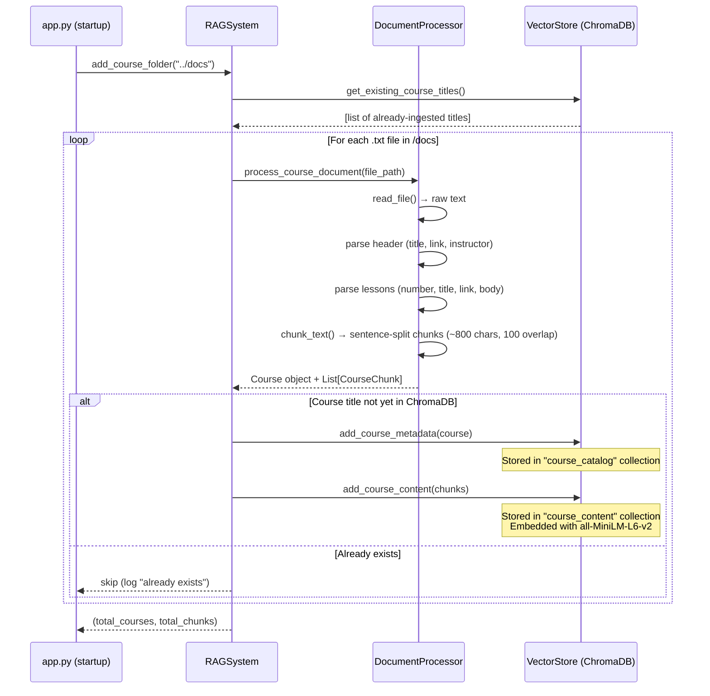
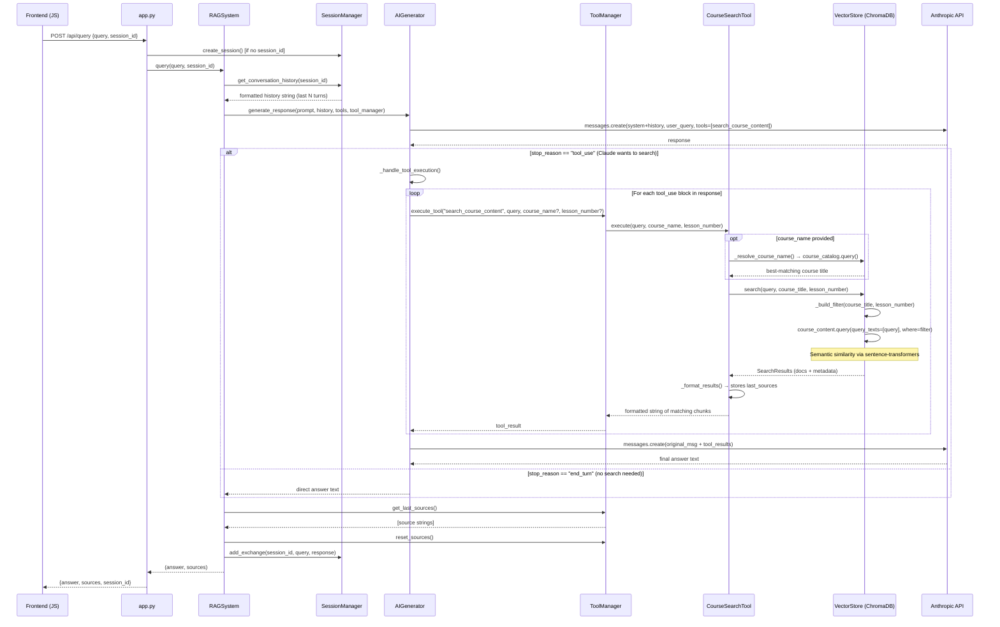

# RAG Chatbot Architecture

## Component Overview

| File | Class | Role |
|---|---|---|
| `app.py` | FastAPI app | HTTP entry point; serves frontend static files |
| `rag_system.py` | `RAGSystem` | Main orchestrator tying all components together |
| `ai_generator.py` | `AIGenerator` | Wraps Anthropic API calls; handles tool-use agentic loop |
| `search_tools.py` | `ToolManager`, `CourseSearchTool` | Claude tool definitions and execution |
| `vector_store.py` | `VectorStore` | ChromaDB persistence — two collections: catalog + content |
| `document_processor.py` | `DocumentProcessor` | Parses `.txt` course files; chunks text |
| `session_manager.py` | `SessionManager` | In-memory conversation history keyed by session ID |
| `models.py` | `Course`, `Lesson`, `CourseChunk` | Shared data models |
| `config.py` | `config` | Central settings (model, paths, chunk sizes, etc.) |

---

## Phase 1 — Document Ingestion (on startup)

Triggered once by the FastAPI `startup` event. Scans `../docs/` and loads any new `.txt` course files into ChromaDB.



### ChromaDB Collections

| Collection | Contents | ID scheme |
|---|---|---|
| `course_catalog` | One doc per course (title text) + metadata (instructor, link, lessons JSON) | `course.title` |
| `course_content` | One doc per chunk (lesson text) + metadata (course\_title, lesson\_number, chunk\_index) | `{course_title}_{chunk_index}` |

---

## Phase 2 — Chat Query (per request)

Every `POST /api/query` triggers a two-stage Claude call when the AI decides to search.



---

## Adding a New Tool

1. Subclass `Tool` in `backend/search_tools.py`
2. Implement `get_tool_definition()` (Anthropic JSON schema) and `execute(**kwargs) -> str`
3. Register in `RAGSystem.__init__()`:
   ```python
   my_tool = MyTool(...)
   self.tool_manager.register_tool(my_tool)
   ```
Claude automatically receives the new tool definition on every query and can choose to call it.

---

## Key Configuration (`backend/config.py`)

| Setting | Default | Effect |
|---|---|---|
| `ANTHROPIC_MODEL` | `claude-sonnet-4-20250514` | Generation model |
| `EMBEDDING_MODEL` | `all-MiniLM-L6-v2` | Embedding model (downloaded on first run) |
| `CHUNK_SIZE` | 800 chars | Max chars per vector chunk |
| `CHUNK_OVERLAP` | 100 chars | Sentence overlap between chunks |
| `MAX_RESULTS` | 5 | Max chunks returned per ChromaDB search |
| `MAX_HISTORY` | 2 | Conversation turns kept per session |
| `CHROMA_PATH` | `./chroma_db` | ChromaDB persistence directory (relative to `backend/`) |
